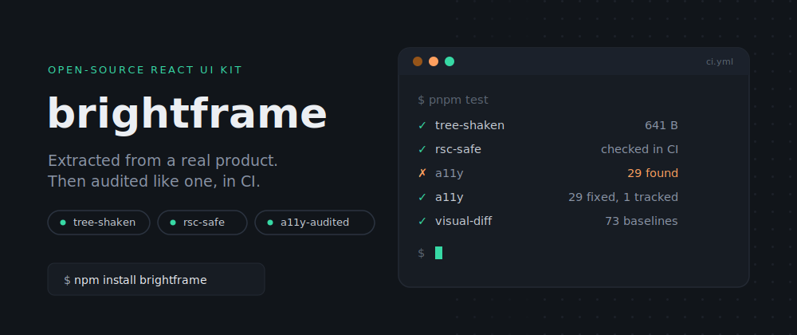
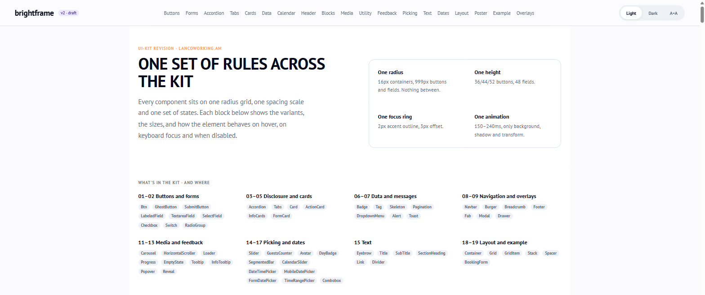
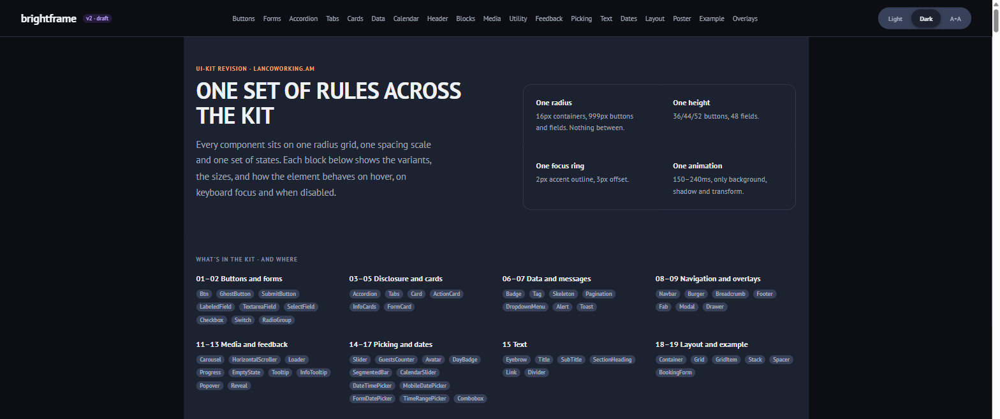
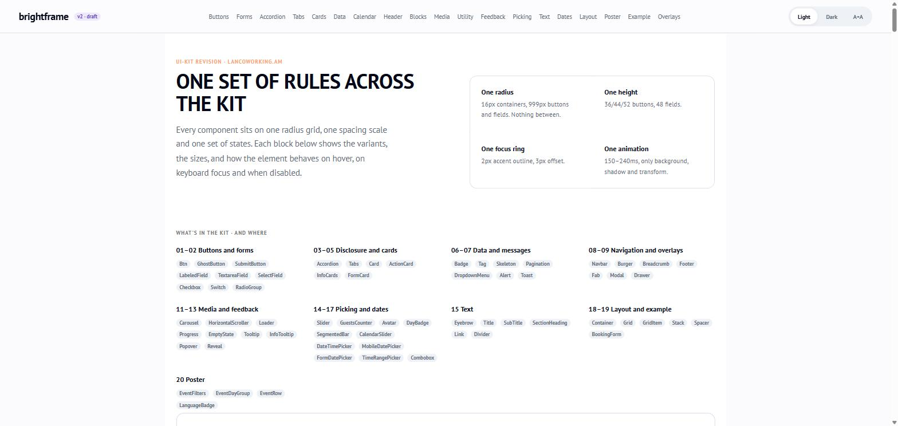
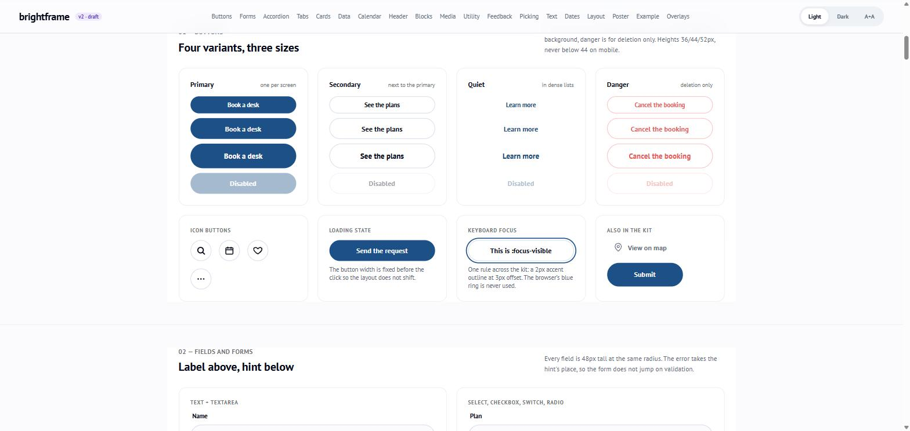
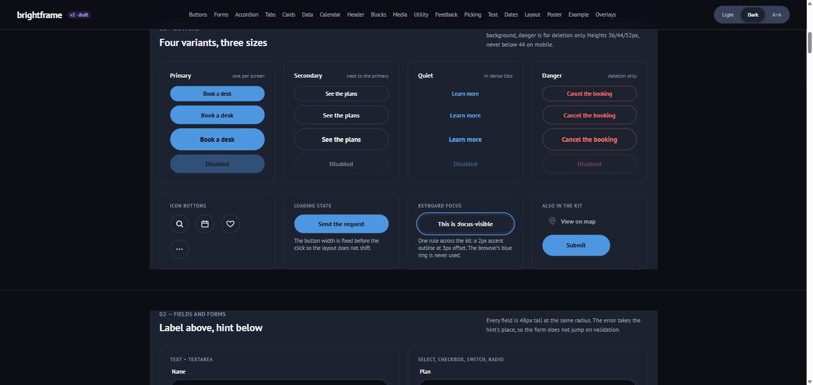
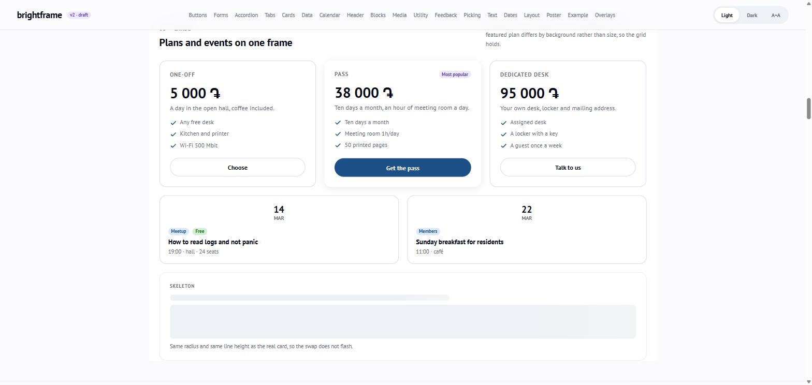
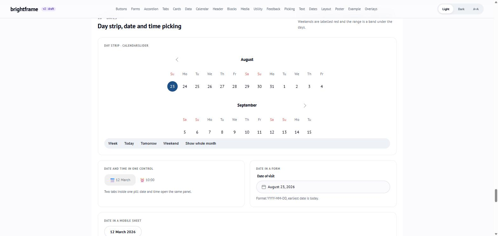

<p align="center">
  
</p>

# brightframe

[](https://www.npmjs.com/package/brightframe)
[](https://github.com/mkokoulin/brightframe/actions/workflows/ci.yml)
[](https://www.npmjs.com/package/brightframe)
[](https://bundlephobia.com/package/brightframe)
[](./LICENSE)
[](https://buymeacoffee.com/kokoulin92u)

[📖 Storybook](https://mkokoulin.github.io/brightframe/) · [📝 Read the writeup](https://dev.to/mikhail_kokoulin_d39d37a5/i-open-sourced-a-ui-kit-then-went-looking-for-everything-i-got-wrong-about-it-4m72) · [☕ Support this project](https://buymeacoffee.com/kokoulin92u)

This is an independent, solo-maintained project. If you find it useful, a ⭐ on [GitHub](https://github.com/mkokoulin/brightframe) is a nice way to show it — and any feedback or suggestions are always welcome.

Independent React UI kit extracted from the [LAN](https://lancoworking.am) coworking site — a small set of presentational primitives (buttons, cards, tags, headings, ...) built on a light/dark/high-contrast design token system.

No app framework, i18n, or routing dependencies — every component here is a pure, self-contained function of its props.

<p align="center">
  
  &nbsp;&nbsp;
  
</p>

<p align="center"><em>Same components, same code — the page above switches from light to dark purely through <code>data-theme</code>, no per-component dark-mode styles. See it live in <a href="https://mkokoulin.github.io/brightframe/?path=/story/overview-ui-kit--default">Storybook</a>.</em></p>

## Full showcase

Every component in the kit lives together on one scrollable page — **[Overview / UI Kit](https://mkokoulin.github.io/brightframe/?path=/story/overview-ui-kit--default)** in Storybook — 20 numbered sections mirroring the original design handoff, from buttons and forms through dates, layout primitives, and full page-composition examples (a booking form, an events poster). It doubles as an integration check: everything shown below renders together, in the same page, from the same tokens.

<p align="center">
  
</p>

<p align="center">
  
  &nbsp;&nbsp;
  
</p>

<p align="center">
  
  &nbsp;&nbsp;
  
</p>

## Why brightframe

- **Token-driven theming, not per-component overrides.** Light, dark, and high-contrast modes come from one `tokens.css` file and a `data-theme`/`data-a11y` attribute — components never hardcode colors.
- **Tree-shakeable per component.** Every component is also its own entry point (`brightframe/Btn`, `brightframe/Btn.css`), so importing one button doesn't pull in the rest of the kit.
- **No framework lock-in.** No Next.js, no router, no i18n dependency — just React and CSS Modules, so it drops into any React 18+ app.
- **Built for real product screens, not just a demo.** It ships full flows like date/time range pickers and a booking form example, not only buttons and cards.
- **Server Components-safe.** Every component is either marked `"use client"` or verified safe to render in a Server Component tree — checked in CI, not just claimed. See [React Server Components](#react-server-components).
- **Accessibility checked where it actually breaks.** `jest-axe` per component, plus every real Storybook story audited in a real browser — composition bugs an isolated test can't see. See [Accessibility](#accessibility).

## Environment Support

- Modern browsers
- Server-side Rendering (Next.js App Router, see [React Server Components](#react-server-components))
- React 18+
- TypeScript 5.0+ (built and tested against 5.6)

| Chrome | Firefox | Safari | Edge |
|---|---|---|---|
| last 2 versions | last 2 versions | last 2 versions | last 2 versions |

No IE support — components rely on CSS custom properties and CSS Modules, neither of which IE implements. Building from source requires Node.js 18+.

Beyond the table above, a few components use specific browser APIs and fall back gracefully where noted:

- `IntersectionObserver` — `Reveal`'s scroll-in animation.
- `matchMedia` — `ThemeProvider`'s `system` theme option and `useMediaQuery` (used internally by `CalendarSlider`).
- `prefers-reduced-motion` — respected by `Reveal`, `Skeleton`, `Carousel`, `Progress`, and `BorderBeam` to disable/simplify animation.

**Module format:** ships as a dual ESM/CJS package (`import`/`require` both resolve via `exports` in `package.json`), plus per-component entry points (`brightframe/Btn`, etc.) — no bundler-specific config needed to consume either format.

**CSS Modules:** styles are shipped pre-compiled (`dist/*.css`), not raw `.module.css` — your bundler doesn't need its own CSS Modules support (e.g. `css-loader`'s `modules` option) to consume brightframe; a plain static CSS import is enough.

**Frameworks:** tested against Next.js (App Router, including SSR/RSC — see [React Server Components](#react-server-components)) and Vite (see [`examples/basic-vite`](./examples/basic-vite)). Should work unchanged with any other React 18+ setup (CRA, Remix, ...) since there's no bundler-specific tooling involved — untested there, but nothing in the kit assumes a particular build tool.

**React Native:** not supported. Every component renders DOM elements and ships CSS Modules — there's no React Native variant, unlike UI kits that publish a separate RN package.

## Install

```bash
npm install brightframe
```

React 18+ and React DOM 18+ are peer dependencies.

## Usage

Import the design tokens once at your app root, then use any component:

```tsx
import "brightframe/tokens.css";
import "brightframe/style.css";
import { Btn, Card, Tag } from "brightframe";

function Example() {
  return (
    <Card variant="elevated" hover>
      <Tag variant="accent">New</Tag>
      <Btn variant="primary" onClick={() => {}}>Register</Btn>
    </Card>
  );
}
```

- `brightframe/tokens.css` — CSS custom properties (colors, shadows, motion, fonts). Required.
- `brightframe/style.css` — compiled component styles (CSS Modules output). Required.
- `brightframe/fonts.css` — loads the default typeface. Optional, see [Fonts](#fonts).

### Importing a single component

Every component also ships as its own entry point, so you don't have to pull in the whole kit (and its whole stylesheet) just to use `<Btn>`:

```tsx
import "brightframe/tokens.css";
import "brightframe/Btn.css";
import { Btn } from "brightframe/Btn";
```

`brightframe/<Name>` mirrors the named export (`Btn`, `Modal`, `Tabs`, `ThemeProvider` via `brightframe/theme`, `PinIcon` via `brightframe/icons`, ...), and `brightframe/<Name>.css` is that component's own stylesheet — both are tree-shaken independently of `brightframe/style.css`, so unused components add nothing to your bundle.

### Bundle size

Measured with [size-limit](https://github.com/ai/size-limit) (`bun run size`), enforced in CI so a regression fails the build instead of quietly shipping:

| Entry | Minified + brotli |
| --- | --- |
| Whole kit (`import { ... } from "brightframe"`, JS) | 40.13 kB |
| Whole kit (`brightframe/style.css`) | 11.83 kB |
| One component (`brightframe/Btn`, JS) | 641 B |
| One component's styles (`brightframe/Btn.css`) | 890 B |

The gap between "whole kit" and "one component" is the point of the per-component entry points above — importing `Btn` alone costs 641 B, not 39.85 kB.

### Fonts

Every component reads its font from one custom property, `--font-sans`, defined in `tokens.css`:

```css
--font-sans: "PT Sans", "Helvetica Neue", Arial, sans-serif;
```

Naming a font isn't the same as loading it — the browser only renders PT Sans if it's actually available on the page. That's what `brightframe/fonts.css` is for: an optional module that loads PT Sans from Google Fonts.

```tsx
import "brightframe/tokens.css";
import "brightframe/fonts.css"; // optional — loads PT Sans
import "brightframe/style.css";
```

Skip it if you already load PT Sans yourself, self-host it, or want a different family entirely — just override `--font-sans` in your own CSS instead:

```css
:root {
  --font-sans: "Inter", system-ui, sans-serif;
}
```

Without either `fonts.css` or your own override, the browser falls back through `--font-sans`'s stack (Helvetica Neue, Arial, then the system sans-serif) — visually close to PT Sans, but not it. See the **Foundations/Fonts** story in [Storybook](https://mkokoulin.github.io/brightframe/) for a live before/after.

### Theming

Tokens respond to `data-theme`/`data-a11y` attributes on any ancestor element (typically `<html>`). You can set these by hand:

```html
<html data-theme="dark">        <!-- dark theme -->
<html data-a11y="visually-impaired"> <!-- high-contrast mode -->
```

Omit both attributes for the light (default) theme. Or use `<ThemeProvider>` to manage them for you:

```tsx
import { ThemeProvider, useTheme } from "brightframe";

function ThemeToggle() {
  const { theme, resolvedTheme, setTheme, toggleTheme, a11y, setA11y } = useTheme();
  return (
    <button onClick={toggleTheme}>
      {resolvedTheme === "dark" ? "🌙" : "☀️"} ({theme})
    </button>
  );
}

export function App() {
  return (
    <ThemeProvider defaultTheme="system"> {/* "light" | "dark" | "system" */}
      <ThemeToggle />
      {/* rest of your app */}
    </ThemeProvider>
  );
}
```

`ThemeProvider`:
- Resolves `"system"` against `prefers-color-scheme` and keeps it in sync if the OS theme changes while mounted.
- Persists the choice to `localStorage` (key configurable via `storageKey`, default `"brightframe"`).
- Applies `data-theme`/`data-a11y` to `document.documentElement` — no wrapper `<div>`, no layout impact.
- Briefly suppresses CSS transitions on theme change so colors don't visibly animate (`disableTransitionOnChange`, default `true`).

For server-rendered apps (Next.js, etc.), pair it with `getThemeInitScript()` to avoid a flash of the wrong theme before hydration — see [EXAMPLES.md](./EXAMPLES.md#3-avoiding-a-flash-of-the-wrong-theme-on-first-paint).

#### Custom brand palette

Pass `palette` to override individual color/shadow tokens per resolved theme, without writing your own CSS file:

```tsx
<ThemeProvider
  palette={{
    light: { "--c-accent": "#7c3aed", "--c-brand": "#0f766e" },
    dark: { "--c-accent": "#a78bfa", "--c-brand": "#2dd4bf" },
  }}
>
  {/* ... */}
</ThemeProvider>
```

Only the tokens you name are changed — everything else keeps its `tokens.css` default. `ThemeTokenVar` (exported from `brightframe`) lists every overridable variable name. Overrides are applied client-side as inline styles on `<html>` after mount, so for SSR apps there's a brief flash of the default palette before hydration (unlike the light/dark/a11y choice itself, this isn't covered by `getThemeInitScript()`).

If you don't need it to be runtime-configurable, overriding the same `--c-*` custom properties in your own global CSS works too, with no flash and no extra JS.

### Customization

Every presentational component (the ones in the first table below) follows the same rules:

- **Native attributes pass through.** `style`, `id`, `data-*`, `aria-*`, event handlers, and any other valid HTML attribute for the underlying element are forwarded — you don't need a wrapper `<div>` to add a `style` override or a `data-testid`.
- **`className` merges**, it never replaces the component's own classes.
- **Polymorphic tag via `as`.** `Title`, `SubTitle`, `SectionHeading`, `Container`, `Eyebrow`, `Grid`, and `GridItem` accept an `as` prop (e.g. `<Title as="h2">`) to change the rendered tag without changing how it looks — use it to keep a single `<h1>` per page while still getting Title's styling elsewhere.
- **Sizes/variants are additive**, existing defaults never change between patch/minor releases.

Interactive form widgets (`MobileDatePicker`, `CalendarSlider`, `TimeRangePicker`, `DateTimePicker`, `SelectField`) intentionally expose a narrower, purpose-built API (`locale`, `labels`, `minDate`/`maxDate`, `businessHours`, ...) instead of raw DOM prop spreading — their root elements carry click-outside/keyboard logic that a stray `onClick` or `style` override could break.

## Components

### Primitives

| Component | Description |
|---|---|

| Component | Description |
|---|---|
| `Btn` | Unified button/link — 7 variants (`primary`, `secondary`, `brand`, `ghost`, `danger`, `external`, `white`), 3 sizes, pill/fullWidth/icon slots |
| `Card` | Surface wrapper — `surface`/`outlined`/`elevated` variants, configurable radius, optional hover animation, renders as `<a>` when `href` is passed |
| `Tag` | Inline label/badge — 9 variants, 3 sizes, optional `onDismiss` for removable filter tags |
| `InfoTooltip` | Hover/focus/click tooltip triggered by a question-mark icon |
| `GhostButton` | Minimal text button with a leading icon (defaults to a pin icon) |
| `Eyebrow` | Small uppercase label above a heading |
| `SectionHeading` | `<h2>` + optional subtitle for section intros |
| `DayBadge` | Calendar-day badge (weekday/day/month), weekend styling, localizable via `locale` |
| `Reveal` | Fade + slide-in wrapper on scroll into view (`IntersectionObserver`), respects `prefers-reduced-motion` |
| `InfoCards` | Responsive icon + text card list (5 built-in icons) |
| `Loader` | Spinning SVG loader, optional dim overlay |
| `Burger` | Animated hamburger menu toggle |
| `Link` | Simple underlined text link |
| `Title` / `SubTitle` | `<h1>` / `<h2>` display headings |
| `Container` | Full-height block with a surface background |
| `Grid` / `GridItem` | Responsive CSS Grid layout — per-breakpoint column count and gap (`columns={{ base: 1, md: 2, lg: 4 }}`), items span columns responsively (`span={{ base: 12, md: 6 }}`) |
| `Badge` | Pins children (typically a `<Tag>`) to a corner of a `position: relative` parent — e.g. a discount ribbon on a card |
| `Fab` | Circular icon-only floating action button — 4 color variants, 3 sizes |
| `EmptyState` | Centered icon + title + description + optional CTA, for empty lists/results |
| `ActionCard` | Clickable tile — icon top-left, always-visible arrow button top-right, title/description below, renders as `<a>` when `href` is passed |
| `Carousel` | Single active slide with prev/next arrow buttons and/or dot pagination, optional autoplay (respects `prefers-reduced-motion`) |
| `HorizontalScroller` | Native scroll-snap horizontal row with edge arrow buttons and a fade mask over hidden content |
| `Modal` | Portal dialog — 3 sizes, footer slot, closes on Escape/overlay click |
| `Tabs` | Content switcher — `line`/`pill` variants, full ARIA `tablist`/`tab`/`tabpanel`, arrow-key navigation |
| `Accordion` | Collapsible disclosure list — single or multiple panels open, CSS-only expand animation |
| `Tooltip` | General-purpose hover/focus bubble around any trigger, 4 positions, optional show delay |
| `Avatar` | Image with initials (from `name`) or icon fallback, 5 sizes |
| `AvatarGroup` | Overlapping avatar stack with a ringed border, optional `max` collapsing the rest into a "+N" avatar |
| `Skeleton` | Shimmering loading placeholder — `text`/`circle`/`rect`, multi-line text, respects `prefers-reduced-motion` |
| `Divider` | Horizontal/vertical separator, optional centered label |
| `Alert` | Inline status banner — info/success/warning/error, optional dismiss button |
| `Progress` | Linear progress bar — determinate or indeterminate, 3 sizes |
| `Breadcrumb` | Nav trail from an `items` array — last item renders as the current page |
| `LanguageSwitch` | Controlled locale pill group, default RU/EN/HY, custom `options` |
| `Pagination` | Page number list with Previous/Next, collapses distant pages behind an ellipsis |
| `Table` | Data table — controlled sorting, row selection, column filters, column highlight, inline cell editing, drag-and-drop row/column reordering (pointer + keyboard), and `Pagination`/footer integration, all opt-in. Also exports `TableRow`/`TableCell`/`TableHeaderCell`/`TableFooter` primitives and a headless `useReorder` hook for hand-rolled table markup |
| `Popover` | Click-triggered floating panel for richer content than `Tooltip` — click-outside/Escape to close |
| `DropdownMenu` | Click-triggered action menu — `role="menu"`, arrow-key navigation, separators, danger items |
| `Drawer` | Portal side panel — left/right/top/bottom placement, same overlay/Escape/body-lock behavior as `Modal` |
| `ToastProvider` / `useToast` | Stacked notification system — `toast()`/`dismiss()`/`dismissAll()`, configurable position and auto-dismiss duration |
| `ThemeProvider` / `useTheme` | Light/dark/system theme + a11y mode, persisted and applied to `<html>` |
| `getThemeInitScript` | Inline script to prevent a flash of the wrong theme on server-rendered pages |

### Layout & navigation

| Component | Description |
|---|---|
| `Navbar` / `NavbarItem` | Page header bar — brand slot, nav items with an active-state pill highlight, right-aligned actions slot for your own theme/language/`<Burger>` controls |
| `Footer` / `FooterColumn` | Responsive footer — 1 column on mobile, side by side from `md` up |

### Form controls

| Component | Description |
|---|---|
| `LabeledField` | Labeled text input, optional prefix (e.g. `+1`) and input mask via `react-imask` |
| `TextareaField` | Labeled textarea with error state |
| `SelectField` | Accessible custom select (listbox pattern, keyboard navigation) |
| `SegmentedBar` / `SegmentedItem` | Segmented control container, e.g. Day / Week / Month toggles |
| `Checkbox` | Custom checkbox — indeterminate state, label, error message |
| `RadioGroup` | Accessible radio group from an `options` array — native arrow-key navigation, vertical/horizontal |
| `Switch` | Boolean toggle (`role="switch"`) |
| `Slider` | Native `<input type="range">`, styled — single value or two-thumb `[min, max]` range |
| `Combobox` | Searchable select — filters an `options` array as you type |
| `GuestsCounter` | Stepper with a label and min/max clamping |
| `SubmitButton` | Form submit button — `accent`/`brand`/`ghost` variants |
| `FormCard` | Padded `<section>` wrapper for grouping a form |
| `FormDatePicker` | Text-field-style trigger that opens `MobileDatePicker` in single-date mode |
| `MobileDatePicker` | Full-screen bottom-sheet calendar (single date or range) |
| `TimeRangePicker` | Date + start/end time range picker with configurable business hours |
| `CalendarSlider` | Two-month range calendar with quick presets (today, this week, ...) |
| `DateTimePicker` | Combined date + time dropdown picker |

All components are named exports and ship their own `.d.ts` types.

### Headless hooks

`Combobox` also ships its logic standalone as `useCombobox` (same open/filter/keyboard-nav behavior, no styling) — for when you need the interaction but not the markup. See [docs/headless-hooks.md](./docs/headless-hooks.md).

## Examples

See [EXAMPLES.md](./EXAMPLES.md) for copy-paste snippets (basic usage, theming, Next.js flash-free setup, page composition), and [`examples/basic-vite`](./examples/basic-vite) for a full runnable app. The [Storybook](https://mkokoulin.github.io/brightframe/) also has an **Examples/Booking Form** story showing most form components wired together into one working form.

## Quality & tooling

The short version of each of these below; the full story (why, what broke, what it took to fix) is in [this writeup](https://dev.to/mikhail_kokoulin_d39d37a5/i-open-sourced-a-ui-kit-then-went-looking-for-everything-i-got-wrong-about-it-4m72).

### React Server Components

Components that use hooks or declare their own DOM event handlers are marked `"use client"`; pure presentational components (`Card`, `Tag`, `Container`, ...) aren't, and cost nothing in a Server Component tree. `scripts/check-use-client.mjs` enforces this in CI so a new component can't ship un-marked. `ThemeProvider`/`useTheme()` need a Client Component boundary — see [docs/rsc.md](./docs/rsc.md) for the details and a Next.js App Router example.

### Accessibility

Every component has a `jest-axe` unit test, and in CI every real Storybook story is also audited in a live Chromium via `@storybook/addon-vitest` + `@storybook/addon-a11y` — catching composition bugs (two components combined breaking each other's semantics) that an isolated per-component test can't. See [docs/a11y-audit.md](./docs/a11y-audit.md) for what that first full pass found and fixed.

### Visual regression

One screenshot baseline per component per theme (light/dark), committed and diffed on every CI run via Vitest's browser-mode `toMatchScreenshot()` — a CSS regression in one component fails the build, including in other components that compose it. See [docs/visual-regression.md](./docs/visual-regression.md).

### Migrating from a legacy kit

If you're moving off an inline, pre-extraction component library the way this kit itself was extracted from `lan-site`'s (see [Origin](#origin)), `codemods/migrate-legacy-kit/` is a generic, config-driven codemod for exactly that — dry-run by default, never rewrites anything it isn't sure about. See its own [README](./codemods/migrate-legacy-kit/README.md).

## Local development

```bash
npm install
npm run storybook       # interactive component playground on :6006
npm run build             # emit dist/ (ESM + CJS + types + CSS)
npm run typecheck
npm run lint
npm run test              # all of the below in one run: jsdom units, browser-mode a11y, visual regression
npm run test:unit         # jsdom unit tests only
npm run test:storybook    # every Storybook story, audited for a11y in a real browser (needs Chromium: `npx playwright install chromium`)
npm run test:visual       # screenshot regression against the committed baselines
npm run test:visual:update # regenerate baselines after an intentional visual change
npm run size              # bundle-size budget check (size-limit)
npm run css-types         # regenerate *.module.css.d.ts (typed class names); runs automatically before build/typecheck/dev
npm run css-types:watch   # same, but watches for CSS changes
```

## Publishing

See [PUBLISHING.md](./PUBLISHING.md) for the full release checklist (versioning, npm login, publishing, post-publish verification, fixing a bad release).

## Origin

These components were extracted from `lan-site`'s internal component library. Two adaptations were made during extraction so the kit has no dependency on that app:

- `Btn`/`GhostButton`/etc. never depend on `next/navigation` — routing is left to the consumer via `href`/`onClick`.
- Legacy components that used plain global CSS classes (`Title`, `SubTitle`, `Link`, `Container`, `Burger`, `Loader`) were converted to CSS Modules to avoid class-name collisions in consuming apps.

## License

MIT
